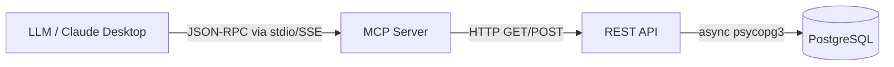

# Architecture & Security Specification

This document details the strict three-layer architecture and the security posture of the PostgreSQL SRE MCP Server.

## The Three-Layer Architecture

To maintain a robust separation of concerns and ensure maximum security, the system is strictly divided into three layers:

### 1. The LLM Layer
The Large Language Model understands user intent, selects the appropriate MCP tools, and formats the responses.
- **Constraint**: The LLM NEVER generates raw SQL. It NEVER connects directly to the database.

### 2. The MCP Layer (FastMCP)
The MCP wrapper translates tool invocations from the LLM into standard HTTP requests.
- **Constraint**: The MCP server MUST NEVER connect directly to PostgreSQL. It has no database connection pool and contains no business logic or SQL.

### 3. The REST API Layer (FastAPI)
The FastAPI backend holds the connection pool, executes hard-coded SQL queries, and applies caching logic.
- **Constraint**: All SQL MUST live inside this layer. It is the only layer authorized to communicate with PostgreSQL.

## Security Posture

> [!CAUTION]
> Direct database access by AI models is an anti-pattern that introduces severe security risks. Our architecture prevents this entirely.

### Restricted Database Roles

The API layer connects to PostgreSQL using two highly restricted roles:
- `sre_read`: Granted access only to system catalogs (`pg_stat_activity`, `pg_class`, `pg_locks`, etc.).
- `sre_ops`: Granted specific execution privileges for operational tasks (e.g., `pg_cancel_backend`, `pg_terminate_backend`, `VACUUM`).

### Lack of Application Data Access

By design, the `sre_read` and `sre_ops` roles are explicitly **DENIED** access to application data tables (e.g., users, transactions, passwords). The tools can determine that a table named `users` is bloated, but they cannot read the rows within the `users` table.

### Audit Logging

All mutable endpoints (POST requests) in the API layer log their actions to an `audit.sqlite` database. This ensures a non-repudiable trail of who executed which operational command, against what target, and whether it was successful.

### Context Optimization (`/schema/context`)

To prevent overwhelming the LLM with massive amounts of DDL (which consumes tokens rapidly and slows down responses), the API implements a `/schema/context` endpoint.
- It aggregates the schema context into a highly compact, cached summary.
- The system uses PostgreSQL `LISTEN/NOTIFY` to detect DDL changes and automatically invalidate the schema cache.
- **Security & Efficiency**: By controlling exactly what schema context is sent, we enforce limits on token consumption and prevent leaking unnecessary structural details.
